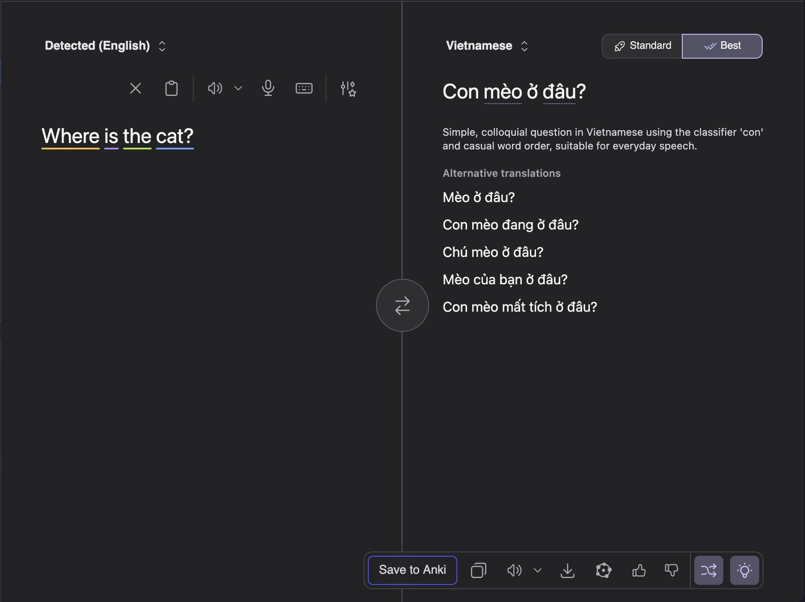
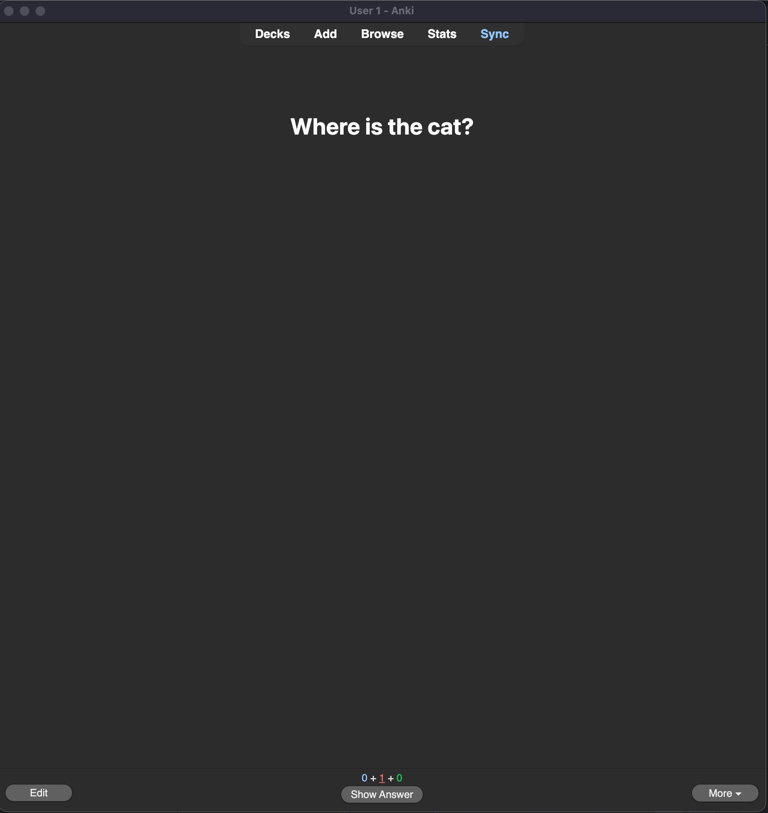
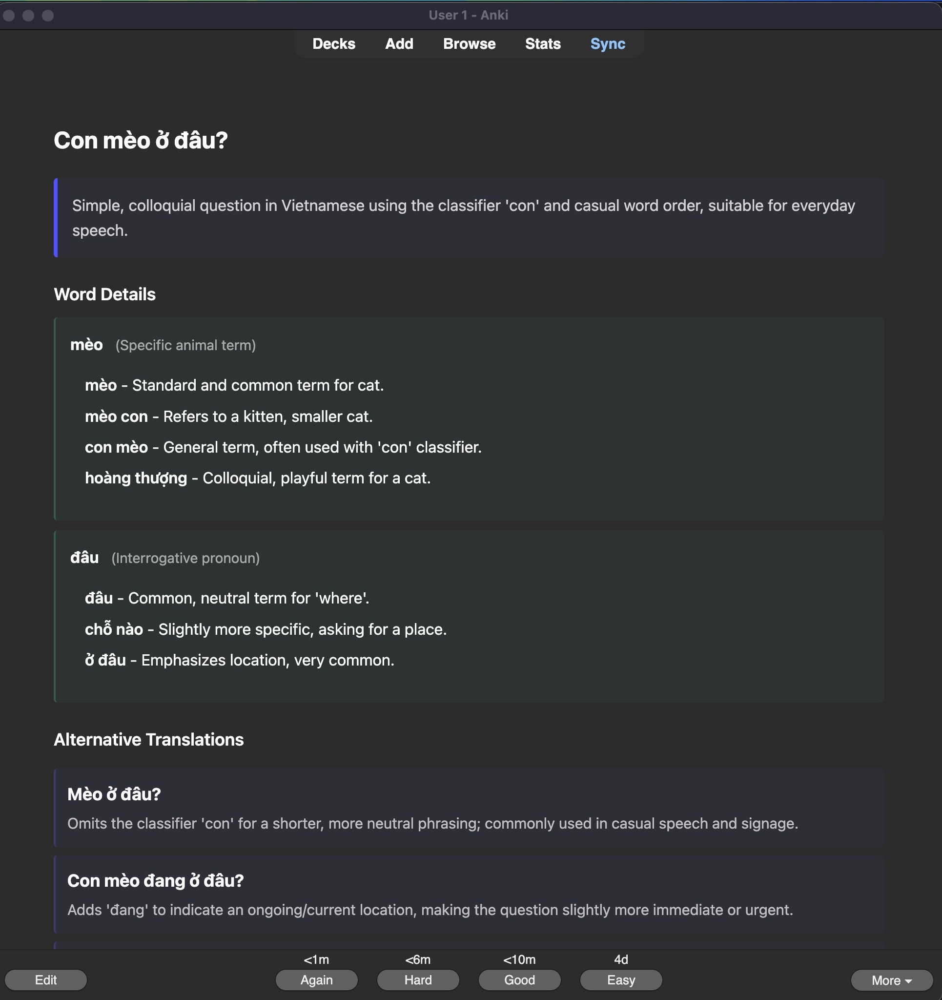

<div align="center" >
<h1>Kagi to Anki</h1>
</div>
<div align="center" style="display:flex;flex-wrap:wrap;gap:0.6rem;justify-content:center;margin:1.5rem 0;">
    <a href="https://opensource.org/licenses/MIT">
        
        </a>
        <a href="https://www.typescriptlang.org/">
        
        </a>
        <a href="https://chrome.google.com/webstore">
        
        </a>
        <a href="https://addons.mozilla.org/en-US/firefox/addon/kagi-translate-to-anki/">
        
        </a>
</div>
<br>

> **Note:** This extension is a hobby project to integrate Kagi Translate and Anki—it isn’t officially affiliated with either project.

<br>

Browser extension to create rich Anki flashcards from [Kagi Translate](https://translate.kagi.com) with audio, word insights, and alternative translations.

## Screenshots

<details>
<summary>Translation Interface</summary>


</details>

<details>
<summary>Settings Page</summary>


</details>

<details>
<summary>Card Front</summary>


</details>

<details>
<summary>Card Back</summary>


</details>

## Why

Since discovering kagi translate, it has been a great resource for me in my language learning. The extra insights and ability to play audio in different voices has been incredibly helpful in understanding sentence structure.

## Features

- **Rich Flashcards**: Captures main translation, alternatives, and linguistic insights
- **Audio Support**: Automatically downloads and embeds pronunciation audio
- **Word-Level Insights**: When you click underlined words in Kagi, those variations are added to the card
- **Auto-tagging**: Cards are tagged by language pair and quality level
- **Configurable decks**: Choose which decks your tranlsations get saved to and what tags they get

## Prerequisites

1. **Anki Desktop** - Download from [ankiweb.net](https://apps.ankiweb.net)
2. **AnkiConnect Add-on** - Install in Anki (Tools → Add-ons → Get Add-ons → Code: `2055492159`)
3. Restart Anki after installing AnkiConnect

This will auto-reload the extension when you make changes.

## Usage

1. **Setup**:

   - Open Anki (must be running)
   - Click the extension icon → Settings
   - Select your preferred deck

2. **Create Flashcards**:

   - Go to [translate.kagi.com](https://translate.kagi.com)
   - Enter a translation
   - (Optional) Click underlined words to view insights - these will be captured!
   - Click the "Save to Anki" button that's in the bottom toolbar where you can copy or download the translation
   - The flashcard is created with audio and all captured data
     \*\*Note - whatever voice you have selected for the audio at the time of saving will be downloaded

3. **Card Structure**:
   - **Front**: Source text
   - **Back**:
     - Translation with audio
     - Translation insight (e.g., "Simple, colloquial question...")
     - Alternative translations with explanations
     - Word-level insights
     - Metadata (language pair, quality, date)

## How It Works

The extension:

1. Monitors Kagi Translate API requests
2. Captures translation data, alternatives, and word insights
3. Downloads audio from Kagi's TTS endpoint
4. Formats everything into an html card
5. Sends to Anki via AnkiConnect

\*\*Note: the voice you have selected in Kagi Translate at the time of saving is what gets downloaded.

Since Kagi tranlsate doesn't currently have an api, we're doing some scraping to get the data we need.

## Privacy

This extension processes all data locally and only communicates with:

- **Kagi Translate** - to fetch translations and audio
- **Your local Anki** - to save flashcards

No data is collected, tracked, or sent to external servers. See [PRIVACY.md](PRIVACY.md) for full details.

## Troubleshooting

### "Anki Not Running" Error

- Make sure Anki is open
- Verify AnkiConnect is installed (Tools → Add-ons)
- Try clicking "Test Connection" in the extension popup

### Audio Not Working

- Check if audio is enabled in Settings
- Verify Kagi's audio playback works (click the speaker icon)
- Some translations may not have audio available

### Cards Not Created

- Check that your selected deck exists in Anki
- Ensure Anki is running with AnkiConnect enabled
- The extension auto-creates the "Kagi Translation" model

## Development

Built with:

- TypeScript
- Vite + vite-plugin-web-extension
- AnkiConnect API

## License

[MIT License](LICENSE) - feel free to use, modify, and distribute.

## Support

If you find this extension helpful, consider:

- Starring this repository
- Sharing feedback or reporting issues

Or support me directly:

<a href="https://www.buymeacoffee.com/TreyG" target="_blank"></a>

**Bitcoin**

```
bc1qzmw57n7escws4rrj3kn4qxr8lalnkas5xvcfck
```

## Credits

- [Kagi Translate](https://translate.kagi.com) for the excellent translation service
- [AnkiConnect](https://foosoft.net/projects/anki-connect/) for the Anki API
